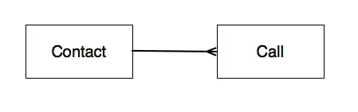
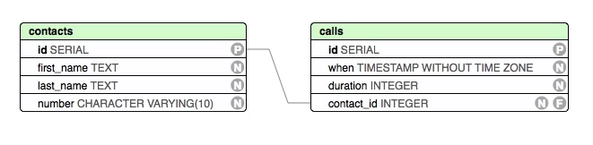
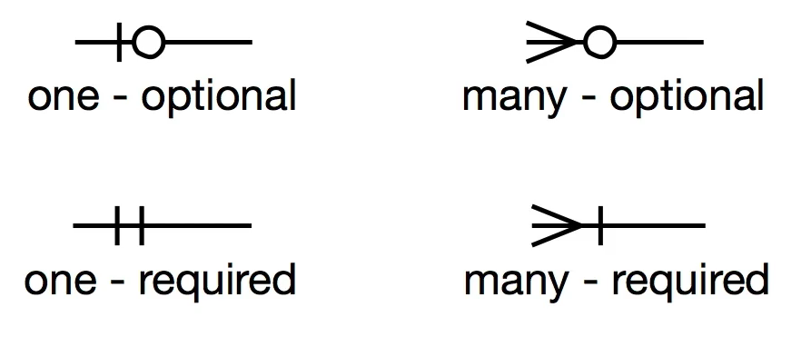
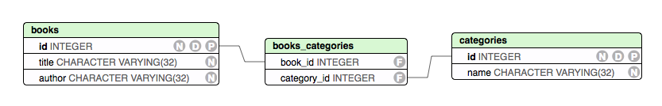

# Relational Data

  * [Overview](#Overview)
  * [Database Diagrams](#Diagrams)
  * [Cardinality and Modality](#Cardinality-Modality)
  * [One to Many](#1-M)
  * [Many to Many](#M-M)

## Overview

  * Relational databases are called **relational** because they persist data in a set in **relations**
  * Relations are essentailly antoher word for *tables*, i.e. a set of columns and rows of data
  * RDBMS such as PostgreSQL also expose some other objects as relations, such as Sequences and Views, but generally when we talk about a relation we are referring to a table within the database
  * Relations can have *relationships* with other relations
    * For example, a 'customers' table in a database would probably have a relationship with another table called 'orders'

## Database Diagrams

  * Database diagrams can display different levels of abstraction, or *schema*
  * There are essentially three levels of schema that can be displayed, from the most abstract to the least abstract:
    * Conceptual
    * Logical
    * Physical
  * It's most common to work at either the conceptual level or the physical level; logical combines aspects of the two
  * The important things to think about when you encounter a diagram
    * What level of schema are you working at
    * How are certain things represented (such as the relationships between entities)

### Conceptual

  * A Conceptual Schema is a high-level design focussed on identifying entities and their relationships
  * The Entity-Relationship Model (ERM) is used to represent conceptual schema, often through use of an Entity-Relationship Diagram (ERD)
  * In terms of a database, an entity would often be analagous to an entire relation (or table)
  * Specific notation can be used within an ERD in order to identify the type of relationship between the entities (e.g. one-to-one, one-to-many, many-to-one)

### Logical

  * A Logical Schema is a low-level but non-database-specific design
  * It might contain tables that have a standard set of columns, but are not specific to the database you are implementing, or might show some elvel of detail such as column attributes but not their data types (Chen's Notation might be an example of a Logical Schema)

### Physical

  * A Physical Schema is a low-level, database-specific design the is focused on implementation
  * A Physical Schema would generally contain representations of the actual tables uses to store the data for the entities described in an ERD
    * This would include a table name, a list of the different columns with information such as column name or column types, and other attributes
      * 'P' would indicate a Primary Key
      * 'F' would indicate a Foreign Key
      * 'N' would indicate 'NOT NULL'
    * In addition, connections between a Foriegn Key in one table and a Primary Key in another would be indicated by a line connecting the columns in the two tables

## Cardinality and Modality

  * Cardinality and Modality are terms used when describing relationships between entities
  * Cardinality refers to the number of objects on each side of the relationship: one-to-one, one-to-many, many-to-many
  * Modality refers to whether the relationship is required (1) or optional (0)
    * If a relationship is required, it means that there has to be at least one instance of that entity
    * If a relationship is not required, it means that there doesn't have to be any instances of that entity
    * 1 and 0 are generally used to indicate modality
  * When Cardinality and Modality are combined, this results in four possible outcomes:
    * One - Optional: there can be zero or one entities of this type
    * One - Required: there must be one and only one entity of this type
    * Many - Optional: there can be zero or more entities of this type
    * Many - Required: there must be at least one, but there can be many, entities of this type
  * Cardinality and Modality are useful for defining the *business rules* that control an application
  * Cardinality and Modality are indicated in ERDs using 'crow's foot notation', which is one of the more common notation types for representing these concepts diagramatically (though other options are available, such as 'Chen's notation')

**Cardinality and Modality Crows Foot Notation**

## One to One Relationships

  * One to One relationships are actually fairly rare in Databases
  * If they exist it often indicates that that relationship should be folded into a single entity
  * The Physical Schema that you create for a One-to-One relationship is actually the same as you would create for a One-to-Many relationship: two tables linked by Primary Key and Foreign Key (though the FK could be on either side of the relationship)
  * Duplication of data can lead to data anomalies:
    * Update anomalies
    * Insertion anomalies
    * Deletion anomalies

## One to Many Relationships

  * When you see a One to Many relationship, say in an ERD diagram, you know that on the 'Many' side there will be a Foreign Key, and on the 'One' side there will be a Primary Key
  * The fundamental idea behind modelling one-to-many relationships is to eliminate, or to reduce as much as much as possible, duplication of data
  * Not restructuring a database to reduce this kind of duplication can lead to data anomalies:
    * Update anomalies
    * Insertion anomalies
    * Deletion anomalies

Example:

  * You have a table of customer data with details such as name, address, phone numbers, email etc..
  * You also store detais of customer orders in the same table
  * If a customer has multiple orders, then all the customer data (name, address, phone) gets duplicated for each order
  * If a customer phone number needs to be changed, you'd need to update every row that contained data about that contact (probably one row for each order). This creates a situation where if we don't update all of the orws correctly we can end up with inconsistent data -- an **update anomaly**
  * If, for example, the columns that contain order data are NOT NULL fields, then we can't record information about a customer unless they have an order; this is known as an **insertion anomaly**
  * If we delete a customer order, we alos lose all of the other information about that customer; this is a **deletion anomaly**

  * **Normalisation** is the is the process of designing schema that minimise or eliminate the possible occurence of these anomalies
  * The basic procedure of normalisation involves extracting data into additional tables and using foreign keys to tie it back to its assocaited data

## Many to Many Relationships

  * Many-to-Many relationships are those where there can be multiple instances of an entity on both sides of the relationship

Example:
  
  * A library might have a database of all its books
  * Each book can have a number of categories, e.g 'fiction', 'international', 'young adult', etc..
  * Each category would apply to multiple books

  * In a conceptual ERD diagram, the relationship might look like this:

  
  

  * When translating the conceptual schema into a physical schema, rather than one table per entity, an additional table would be required in order to map the relationship between the two

  

  * This new table, generally referred to as a *join table*, is responsible for storing information about the relationships between the entities in two other tables
  * It usually contains the Primary Keys from both of the tables which it is 'joining' as Foreign Keys
  * It can also contain its own Primary Key, such as an `id` column for each row; in these cases such tables are treated as *first class entities* within the system (frameworks such as Rails, for example, use this convention)
